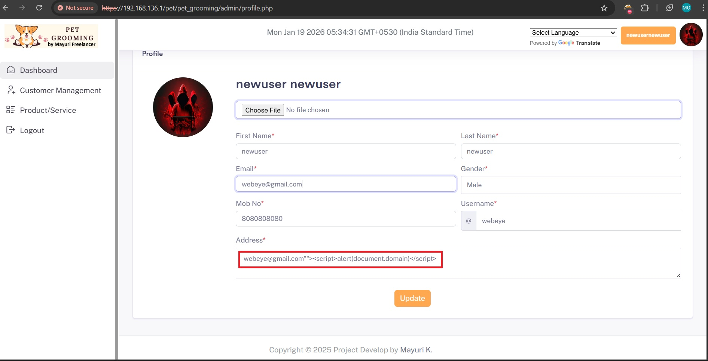
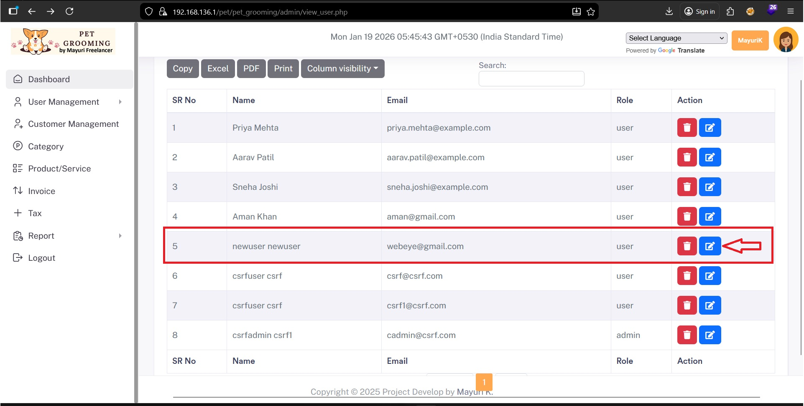
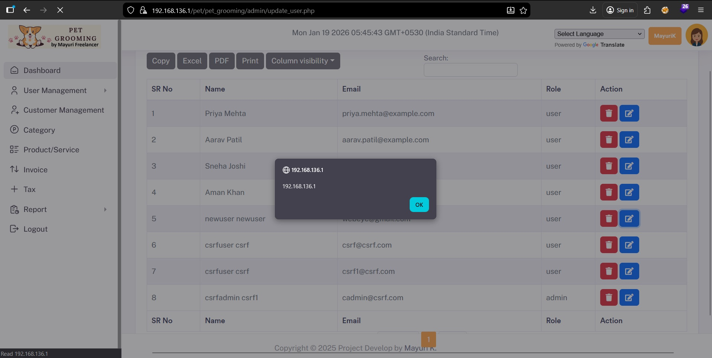

# Stored Cross-Site Scripting (XSS) in Sourcecodester Pet Grooming Management Software Affecting admin.

- **Product Name:** Pet Grooming Management Software
- **Vendor:** SourceCodester
- **Product Page:**
  https://www.sourcecodester.com/php/18340/pet-grooming-management-software-download.html

------

## Summary

Pet Grooming Management Software contains a **stored cross-site scripting (XSS) vulnerability** in the **User Profile update functionality**. The application fails to sanitize or encode user-supplied input before storing it in the database.

An authenticated low-privileged user can inject malicious JavaScript into the **Address** field. When an administrator later views the affected user profile via the **Admin Panel**, the stored payload is executed in the administrator’s browser context.

This allows attackers to perform malicious actions such as **session hijacking, privilege escalation, and unauthorized administrative actions**.

------

## Proof of Concept (PoC)

### Step 1: Inject Malicious Payload (User Side)

Login as a **normal user** and navigate to:

```
User Panel → Profile → Edit Profile
```

Insert the following payload into the **Address** field:

```
"><script>alert(document.domain)</script>
```

Save the profile changes.



------

### Step 2: Trigger Payload (Admin Side)

1. Login as **Administrator**

2. Navigate to:

   ```
   Admin Panel → User Management → View User
   ```

3. Open the affected user profile





------

## Successful Exploitation

When the administrator views the compromised user profile, the injected JavaScript executes automatically in the admin’s browser, confirming a **stored cross-site scripting vulnerability**.

------

## Impact

An attacker can:

- Execute arbitrary JavaScript in admin context
- Steal admin session cookies
- Perform administrative actions via CSRF
- Create or delete users
- Modify application settings
- Escalate privileges within the application

This vulnerability may lead to **full administrative compromise**.

------

## Root Cause Analysis

- Missing server-side input validation
- Absence of output encoding (`htmlspecialchars`)
- Trusting user-controlled data in HTML context

------

## References

- OWASP Cross-Site Scripting (XSS)
- CWE-79: Improper Neutralization of Input During Web Page Generation
- OWASP Top 10 – A03: Injection

------

## Discovered By

**Mo Asim** (also known as **Asim Qazi**)
 Student | Security Researcher

- GitHub: https://github.com/Asim-Qazi
- LinkedIn: https://www.linkedin.com/in/masimqazi
